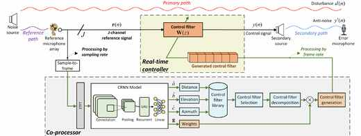

# Spatial-Frequency Cued GFANC

Code release for the paper:

**Spatial-Frequency Cued Generative Fixed-Filter Active Noise Control Based on Deep Learning in Reverberant Environments**



To replace the README figure with a higher-resolution version, upload a new image with the same path:

```text
assets/sf_gfanc_overview.jpg
```

GitHub will display the new image automatically after the file is overwritten and pushed.

## Paper Highlights

This work proposes **SF-GFANC**, a spatial-frequency cued generative fixed-filter active noise control method for reverberant environments.

- It extends GFANC by jointly using the **3D source location** and the **frequency characteristics** of the noise source.
- A lightweight multi-task **CRNN** estimates distance, elevation, azimuth, and sub-filter combination weights from multi-channel STFT features.
- A pre-trained spatial control-filter library provides location-aware candidate filters, while the CRNN regression output generates frequency-adaptive filters.
- The co-processor and real-time controller run in parallel: CRNN inference is performed at the frame rate, while ANC filtering remains at the sampling rate.
- Simulations with unseen rooms, unseen noises, and measured acoustic paths show robust localization and improved noise reduction over representative ANC baselines.

## Released Materials

The current public release includes the executable reverberation-robustness experiment and the runtime assets needed to reproduce it:

- `notebooks/fig10_nr_vs_rt60.ipynb`: executable Fig. 10 notebook.
- `CRNN.py`: CRNN model definition used by the notebook.
- `MyDataLoader_2D_BX.py`: STFT magnitude/phase feature construction.
- `utilities_funcs.py`: microphone geometry, AWGN, and filter reconstruction helpers.
- `Fixed_filter_noise_cancellation_2x1x1.py`: frame-wise fixed-filter controller.
- `CRNN_models/2D_v1002_CRNN_merged_v5.pth`: trained CRNN checkpoint.
- `pretrained_control_filters/`: pre-trained control filters for `RT60 = 0.1 ... 0.9 s`.
- `SecondaryPath_final.mat`: simulated secondary path used by the ANC controller.
- `finaltest_noises/`: real-noise examples used by the notebook.
- `outputs/fig10_nr_vs_rt60.png`: saved preview figure from the executed notebook.

Training-set generation scripts and full training datasets are not included in this release.

## Environment

The code was verified with Python 3.10.

Install the dependencies:

```bash
pip install -r requirements.txt
```

Key dependencies include `numpy`, `scipy`, `pandas`, `matplotlib`, `torch`, `torchaudio`, `soundfile`, and `gpuRIR`.

## Run the Notebook

From the repository root:

```bash
jupyter notebook notebooks/fig10_nr_vs_rt60.ipynb
```

Then run all cells. The notebook will load the trained CRNN, simulate reverberant reference signals for `RT60 = 0.1 ... 0.9 s`, select and reconstruct the corresponding SF-GFANC filters, and plot the averaged noise reduction versus reverberation time.

The generated figure is also saved to:

```text
outputs/fig10_nr_vs_rt60.png
```

## Citation

If this code is useful for your research, please cite the paper:

```text
Spatial-Frequency Cued Generative Fixed-Filter Active Noise Control
Based on Deep Learning in Reverberant Environments
```
